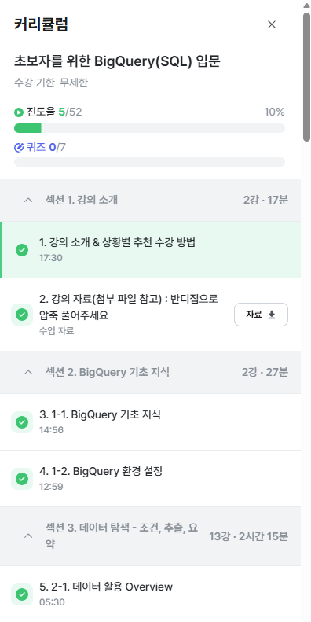

# 📘 SQL_BASIC 1주차 정규 과제

SQL_BASIC 정규 과제는 매주 정해진 분량의 `초보자를 위한 BigQuery(SQL) 입문` 강의를 듣고, 핵심 개념을 정리한 뒤 간단한 SQL 문제를 직접 풀어보는 방식으로 진행합니다.

이번 주는 BigQuery 환경과 SQL의 기본 구조를 익히고, 데이터가 어떤 형태로 저장되고 활용되는지 생각해봅니다.

완성된 과제는 Github에 업로드하고, 링크를 스프레드시트 'SQL' 시트에 입력해 제출해주세요.

**👀 수행 인증란은 필수입니다.**

---

## 📚 SQL_BASIC_1st_TIL

### 섹션 2. BigQuery 기초 지식

### 1-1. BigQuery 기초 지식

### 1-2. BigQuery 환경 설정

### 섹션 3. 데이터 탐색 - 조건, 추출, 요약

### 2-1. 데이터 활용 Overview

---

## ✨ 선택 강의

- 1. 강의 소개 & 상황별 추천 수강 방법 미리보기: 강의 전체 구성과 수강 방향을 확인하고 싶을 때 선택 수강

---

## 🏁 전체 강의 수강 계획

| 주차 | 필수 강의 범위 | 선택 강의 | 완료 여부 |
| --- | --- | --- | --- |
| 1주차 | 1-1 ~ 2-1 | 1 | ✅ |
| 2주차 | 2-2 ~ 2-3 | 2-4 | 🍽️ |
| 3주차 | 2-5, 2-7 ~ 2-8 | 2-6 | 🍽️ |
| 4주차 | 3-2 ~ 4-3 | 3-4 | 🍽️ |
| 5주차 | 4-4 ~ 4-6 | 4-5, 4-7 | 🍽️ |
| 6주차 | 5-2 ~ 5-5 | 5-6 | 🍽️ |
| 7주차 | 필수 강의 없음 | 6-2, 6-3, 6-4, 6-5 | 🍽️ |

---

<br>

<!-- 여기까진 그대로 둬 주세요-->

---

# 1️⃣ 개념 정리

아래 키워드 중 중요하다고 생각한 개념을 2개 이상 골라 짧게 정리해주세요. 3개보다 더 많이 정리하고 싶다면 자유롭게 항목을 추가해도 좋습니다.

이번 주 키워드:
- SQL
- BigQuery
- Database
- Table
- Row
- Column
- 데이터 활용 과정

## 01.

```
개념 이름: SQL
개념 설명: 데이터베이스에서 데이터를 추출하기 위해 사용하는 프로그래밍 언어. SQL을 짠다는 표현은 쿼리문을 짠다는 표현과 같은 뜻이다. 
활용 상황: 데이터베이스의 관리와 데이터 분석 등을 위해 데이터를 추출할 때 사용한다. 
```

## 02.

```
개념 이름: BigQuery
개념 설명: 거래에 특화된 OLTP로 데이터 분석을 하는 것은 한계점이 있었기에 추후 OLAP가 등장하였다. 이를 데이터를 한 곳에 모아 저장하는 창고인 데이터 웨어하우스(DW)와 합쳐서 만든 것이 Google Cloud의 BigQuery이다. 
활용 상황: 데이터를 저장하는 역할을 하기도 하고, 저장된 데이터를 추출하는 쿼리를 실행할 수도 있다.
```

## 03.

```
개념 이름: Database
개념 설명: 데이터베이스는 데이터의 저장소로, DB라고 표현하기도 한다. 데이터베이스 안의 테이블에 데이터를 저장하게 된다. 
활용 상황: 예시로 회사에서 상품 및 서비스의 생산과 개발, 고객 관리 등을 위해 정보를 정리하고 저장할 때 사용할 수 있다. 
```

---

# 2️⃣ 수행 인증란

아래 중 하나 이상을 첨부해주세요.

- 강의 수강 화면 캡처
- 이번 주 학습 내용을 정리한 노트 캡처



---

# 3️⃣ 확인 문제

## 🧩 문제 1

포켓몬 게임이나 이커머스 산업과 같이 다양한 산업에서는 각기 다른 데이터가 존재합니다. 다음 중 하나의 산업을 선택하고, 해당 산업에서 수집하고 활용될 수 있는 데이터 항목, 즉 컬럼 5가지를 자유롭게 상상하여 나열해주세요.

예시 산업:
- 온라인 음식 배달
- 스마트 헬스 케어
- 중고 거래 앱
- 교육 플랫폼

풀이 과정:

```
- 선택한 산업: 중고 거래 앱
- 떠올린 컬럼 5가지: user id, 거래 횟수, 거래 품목, 상품 판매 가격, 상점 평점
- 해당 컬럼이 필요하다고 생각한 이유: 중고 거래 앱에서는 서비스를 이용하는 거래자들을 관리하는 것이 가장 중요하다고 생각하기 때문에, 이용자를 구분하기 위해 user id 컬럼이 필요하다. 거래 횟수나 상점 평점과 같은 정보는 해당 판매자가 얼마나 신뢰성 있고 친절한 판매자인지를 관리자와 다른 이용자들이 편히 알 수 있게 한다. 거래 품목과 상품 판매 가격은 해당 이용자가 혹시 불건전하거나 불법의 위험성이 있는 품목을 거래하는지 관리하기에 용이한 정보로 활용될 수 있다. 
```

## 🧩 문제 2

이번 강의를 통해 SQL이 왜 필요하다고 느끼는지, SQL을 통해 본인이 어떤 것을 해내고 싶은지를 자유롭게 작성해주세요.

풀이 과정:

```
- SQL이 필요하다고 느낀 이유: 실제 업무를 위해 데이터 분석을 진행할 때 마주해야 하는 데이터의 개수는 무수히 많다. 
- SQL로 해보고 싶은 일:
- 앞으로 SQL을 공부할 때 기대되는 점:
```

---

# 4️⃣ 이번 주 회고

```
1. SQL을 처음 써보면서 가장 낯설었던 점: 
2. 다음 주에 더 익숙해지고 싶은 부분:
3. 과제 진행 중 막혔던 부분이 있다면:
```

수고하셨습니다!


