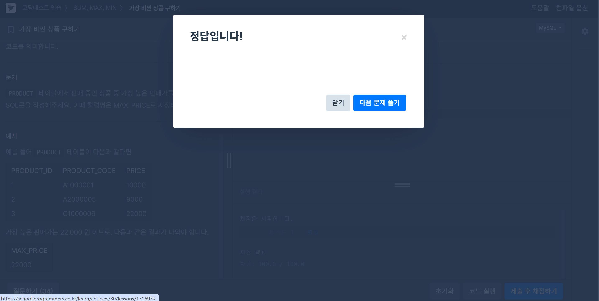

# 📘 SQL_BASIC 3주차 정규 과제

SQL_BASIC 정규 과제는 매주 정해진 분량의 `초보자를 위한 BigQuery(SQL) 입문` 강의를 듣고, 핵심 개념을 정리한 뒤 간단한 SQL 문제를 직접 풀어보는 방식으로 진행합니다.

이번 주는 집계 함수와 `GROUP BY`, `HAVING`을 학습합니다.

완성된 과제는 Github에 업로드하고, 링크를 스프레드시트 'SQL' 시트에 입력해 제출해주세요.

**👀 수행 인증란은 필수입니다.**

---

## 📚 SQL_BASIC_3rd_TIL

### 섹션 3. 데이터 탐색 - 조건, 추출, 요약

### 2-5. 집계(GROUP BY + HAVING + SUM/COUNT)

### 2-7. 정리

### 2-8. 새로운 집계 함수 소개(GROUP BY ALL, 2024-02-26에 나온 함수)

---

## ✨ 선택 강의

- 2-6. 연습 문제: 집계와 조건 조회를 더 연습하고 싶을 때 선택 수강

---

## 🏁 전체 강의 수강 계획

| 주차 | 필수 강의 범위 | 선택 강의 | 완료 여부 |
| --- | --- | --- | --- |
| 1주차 | 1-1 ~ 2-1 | 1 | ✅ |
| 2주차 | 2-2 ~ 2-3 | 2-4 | ✅ |
| 3주차 | 2-5, 2-7 ~ 2-8 | 2-6 | ✅ |
| 4주차 | 3-2 ~ 4-3 | 3-4 | 🍽️ |
| 5주차 | 4-4 ~ 4-6 | 4-5, 4-7 | 🍽️ |
| 6주차 | 5-2 ~ 5-5 | 5-6 | 🍽️ |
| 7주차 | 필수 강의 없음 | 6-2, 6-3, 6-4, 6-5 | 🍽️ |

---

<br>

<!-- 여기까진 그대로 둬 주세요-->

---

# 1️⃣ 개념 정리

아래 키워드 중 중요하다고 생각한 개념을 2개 이상 골라 짧게 정리해주세요. 3개보다 더 많이 정리하고 싶다면 자유롭게 항목을 추가해도 좋습니다.

이번 주 키워드:
- COUNT
- SUM
- AVG
- MAX
- MIN
- GROUP BY
- HAVING
- 집계 기준

## 01.

```
개념 이름: GROUP BY
개념 설명: 같은 값끼리 모아서 그룹화하는 것. 조건에 따라 기준 컬럼을 설정한 후, 다른 컬럼에서 합(SUM)이나 평균(AVG), 최댓값(MAX), 최소값(MIN) 등을 계산할 수도 있다.
예시 쿼리:
SELECT
    generation, 
    COUNT(id) AS cnt 
FROM basic.pokemon
GROUP BY #근데 이용하는 컬럼이 안 정해진 경우도 있다. 전체 데이터 대상
    generation

-> 포켓몬의 수가 세대별로 몇 마리 있는지 확인
```

## 02.

```
개념 이름: HAVING
개념 설명: Table에 바로 조건을 설정하는 WHERER와 달리(같은 쿼리 내에서 같이 쓸 수O), GROUP BY한 후 조건을 설정하고 싶은 경우 사용. 즉 집계를 통해 새로 만들어진 컬럼에 조건을 건다. 조건을 건다는 점에서는 동일.
예시 쿼리:
SELECT 
    type1,
    COUNT(id) AS cnt
FROM basic.pokemon
GROUP BY 
    type1
HAVING cnt >= 10
ORDER BY cnt DESC

-> 포켓몬의 수를 타입별로 집계하고, 포켓몬의 수가 10 이상인 타입만 남긴 후, 내림차순으로 정렬
```

## 03.

```
개념 이름: ORDER BY
개념 설명: 주로 가장 마지막에 작성되고, 값을 내림차순(DESC) 또는 오름차순(OSC-디폴트)으로 정렬함
예시 쿼리:
SELECT
    col
FROM 
ORDER BY col DESC
```

## 04.

```
개념 이름: LIMIT
개념 설명: 가장 마지막에 작성되고(order by->limit), 쿼리문의 결과 row 수를 제한하고 싶을 때 사용
예시 쿼리:
SELECT
    col
FROM 
ORDERY BY 
LIMIT 10
```

---


# 2️⃣ 수행 인증란

아래 중 하나 이상을 첨부해주세요.

- 강의 수강 화면 캡처
- 문제 풀이 정답 화면 캡처
- SQL 실행 결과 화면 캡처


.png)

---

# 3️⃣ 확인 문제

프로그래머스는 로그인이 필요하므로, 로그인 후 문제 풀이를 진행해주세요.

## 🧩 문제 1

문제 링크: [최댓값 구하기](https://school.programmers.co.kr/learn/courses/30/lessons/59415)

풀이 과정:   
SELECT   
    MAX(DATETIME) AS maxdate   
FROM ANIMAL_INS   

```
- 문제 요구사항: 가장 최근에 들어온(DATETIME col 사용) 동물의 보호 시작일이 출력되어야 함
- 사용한 SQL 절: MAX(col) AS name - 최댓값 구하기
- 새로 배운 점: GROUP BY와 SUM, AVG, MIN, MAX 등 집계 함수를 같이 쓰지 않아도 된다는 점을 기억해두기
```


## 🧩 문제 2

문제 링크: [가장 비싼 상품 구하기](https://school.programmers.co.kr/learn/courses/30/lessons/131697)

풀이 과정:   
SELECT   
    MAX(PRICE) AS MAX_PRICE   
FROM PRODUCT   

```
- 사용한 집계 함수: MAX(col) AS name - 최댓값 구하기
- 집계 대상 컬럼: PRICE
- 결과를 검증한 방법: 문제 1과 동일하게, 기준이 되는 컬럼은 없었고 특정 컬럼 값을 집계하여 가장 큰 값을 찾아내면 되는 방식이었기에 같은 흐름으로 풀이를 진행했다. 
```



## 🧩 문제 3

문제 링크: [고양이와 개는 몇 마리 있을까](https://school.programmers.co.kr/learn/courses/30/lessons/59040)

풀이 과정:   
SELECT   
    ANIMAL_TYPE,   
    COUNT(ANIMAL_ID) AS count   
FROM ANIMAL_INS   
WHERE ANIMAL_TYPE IN ('Cat', 'Dog')   
GROUP BY ANIMAL_TYPE   
ORDER BY ANIMAL_TYPE   

```
- 그룹화 기준: 개와 고양이를 구분할 수 있는 ANIMAL_TYPE
- WHERE와 HAVING 중 사용한 절: 그룹화 전에 WHERE을 사용하여 ANIMAL_TYPE내에서 항목을 개와 고양이로 한정했다. 
- 처음 틀렸다면 틀린 이유: SELECT 에서 ANIMAL_TYPE 뒤에 콤마를 적지 않았다. 현재 엔터로 구분되어 있어 자꾸 콤마를 쓰는 것을 잊는데, 가독성을 위해 엔터를 쳤을 뿐 원래는 한 줄이니 콤마로 구분할 것을 잊지 말자
- 새로 배운 SQL 패턴: ORDER BY 는 숫자 뿐만 아니라, 알파벳에도 적용된다! / IN은 여러 값 중 하나에 해당하는지를 확인할 때 쓴다. 원래라면   
WHERE ANIMAL_TYPE = 'Cat'
    OR ANIMAL_TYPE = 'Dog'
로 써야 할 것을 줄여서 쓸 수 있는 것   
(NOT IN)도 가능(-> 개나 고양이가 아닌 동물을 가져옴)
```


---

# 4️⃣ 이번 주 회고

```
1. 문제를 SQL로 옮길 때 가장 어려웠던 부분: 집계의 대상이 되는 컬럼과 그룹화의 기준이 되는 컬럼을 구분하는 것
2. WHERE와 HAVING의 차이를 어떻게 이해했는지: 둘 다 조건을 거는 함수라는 점에서는 동일하지만, WHERE은 테이블에 직접 적용되는 반면 HAVING은 그룹화 후의 결과에 적용된다는 점이 다르다.
3. 다음 주에 더 연습하고 싶은 문제 유형: 다른 집계 함수를 쓰는 문제도 연습해보고 싶다. 
```

수고하셨습니다!


