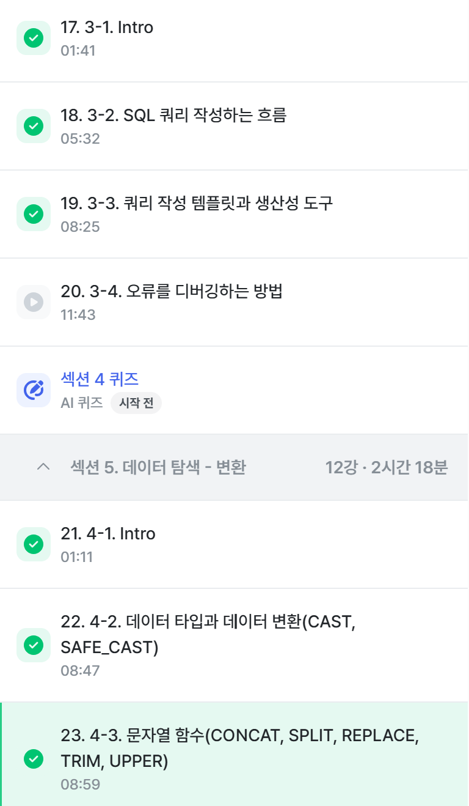
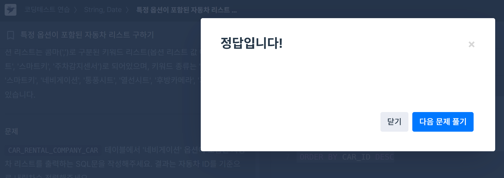
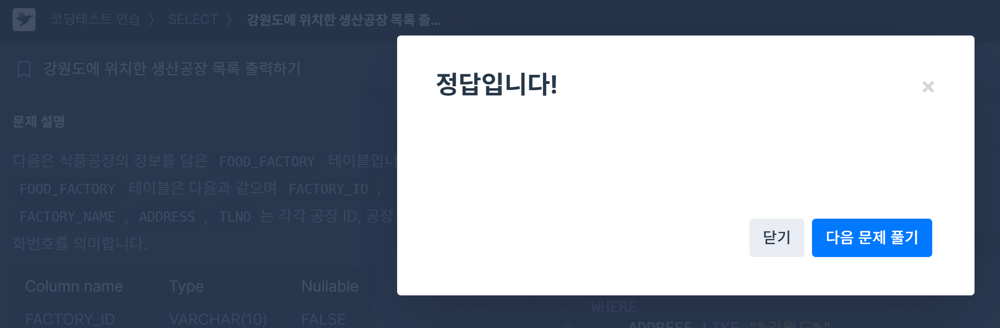
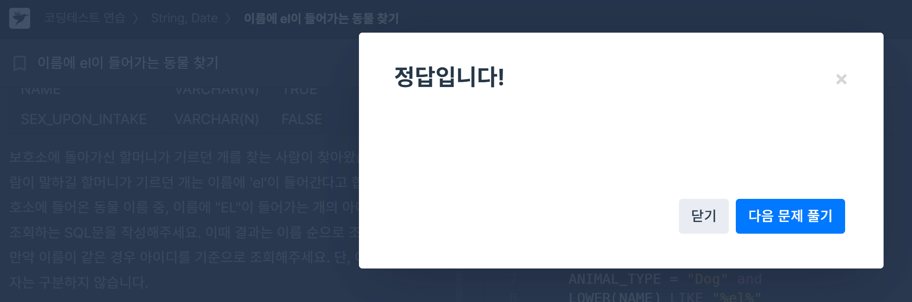
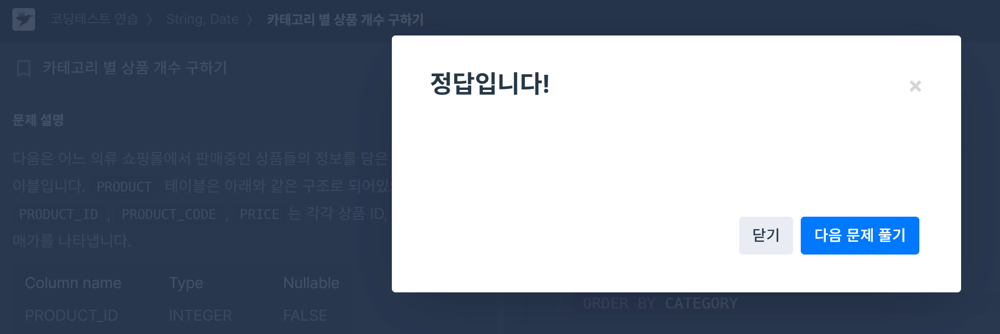

# 📘 SQL_BASIC 4주차 정규 과제

SQL_BASIC 정규 과제는 매주 정해진 분량의 `초보자를 위한 BigQuery(SQL) 입문` 강의를 듣고, 핵심 개념을 정리한 뒤 간단한 SQL 문제를 직접 풀어보는 방식으로 진행합니다.

이번 주는 SQL 쿼리를 작성하는 흐름, 쿼리 작성 템플릿, 데이터 타입 변환, 문자열 함수를 학습합니다.

완성된 과제는 Github에 업로드하고, 링크를 스프레드시트 'SQL' 시트에 입력해 제출해주세요.

**👀 수행 인증란은 필수입니다.**

---

## 📚 SQL_BASIC_4th_TIL

### 섹션 4. SQL 쿼리 잘 작성하기, 쿼리 작성 템플릿 및 오류를 잘 디버깅하기

### 3-2. SQL 쿼리를 작성하는 흐름

### 3-3. 쿼리 작성 템플릿과 생산성 도구

### 섹션 5. 데이터 탐색 - 변환

### 4-1. INTRO

### 4-2. 데이터 타입과 데이터 변환(CAST, SAFE_CAST)

### 4-3. 문자열 함수(CONCAT, SPLIT, REPLACE, TRIM, UPPER)

---

## ✨ 선택 강의

- 3-4. 오류를 디버깅하는 방법: 오류 메시지 해석과 디버깅 흐름을 더 익히고 싶을 때 선택 수강

---

## 🏁 전체 강의 수강 계획

| 주차 | 필수 강의 범위 | 선택 강의 | 완료 여부 |
| --- | --- | --- | --- |
| 1주차 | 1-1 ~ 2-1 | 1 | ✅ |
| 2주차 | 2-2 ~ 2-3 | 2-4 | ✅ |
| 3주차 | 2-5, 2-7 ~ 2-8 | 2-6 | ✅ |
| 4주차 | 3-2 ~ 4-3 | 3-4 | ✅ |
| 5주차 | 4-4 ~ 4-6 | 4-5, 4-7 | 🍽️ |
| 6주차 | 5-2 ~ 5-5 | 5-6 | 🍽️ |
| 7주차 | 필수 강의 없음 | 6-2, 6-3, 6-4, 6-5 | 🍽️ |

---

<br>

<!-- 여기까진 그대로 둬 주세요-->

---

# 1️⃣ 개념 정리

아래 키워드 중 중요하다고 생각한 개념을 2개 이상 골라 짧게 정리해주세요. 3개보다 더 많이 정리하고 싶다면 자유롭게 항목을 추가해도 좋습니다.

이번 주 키워드:
- 쿼리 작성 순서
- 쿼리 작성 템플릿
- 데이터 타입
- CAST
- SAFE_CAST
- CONCAT
- REPLACE
- TRIM

## 01.

```
개념 이름: 쿼리 작성 순서

개념 설명:   
1. 지표 고민 = 문제정의 -> 필요한 데이터 확인       
2. 지표 구체화 = 구체적인 지표 정의(분자, 분모 표시 / 이름)        
3. 지표 탐색 = 유사한 문제를 해결한 케이스 확인 / 해당 쿼리 리뷰       
4. (3에서 있으면 최대한 고대로 쓰고 없으면) 쿼리 작성 = 데이터가 있는 테이블 찾기; 2개 이상시 연결(join) 방법 고민   
5. 데이터 정합성 확인 = 예상한 결과와 동일한지 확인   
6. 쿼리 가독성 = 나중을 위해 깔끔하게 쿼리 작성   
7. 쿼리 저장 = 쿼리는 재사용되므로 문서로 저장   

추가 설명:   
- 꼭 지표에 대한 이름을 적는 등 구체적인 정의를 내리자 -> 2단계 말하는거
- 1-3 단계는 특히 업무 등에서 중요
```

## 02.

```
개념 이름: 쿼리 작성 템플릿

개념 설명:
- 쿼리를 작성하는 목표, 확인할 지표(정의):
- 쿼리 계산 방법:
- 데이터의 기간:
- 사용할 테이블:
- Join KEY:
- 데이터 특징:

템플릿을 사용하는 것 자체를 까먹을 수o    
=> 생산성 도구(ex. Espanso)를 쓰자!!
Espanso -> 핵심 로직: 특정 단어가 감지되면 정의된 것으로 바꾼다!

추가 설명:
- 위의 템플릿을 !sql로 저장하였음
- 이후 espanso 에서 추가로 트리거를 저장하고 싶다면 vscode에서 appdata->roaming->espanso->match->base파일 찾아서 해주자
- 상태표시줄에서 앱클릭 후 'reload config'해야 반영 된다했는데 vscode 에서 저장 시 바로 반영되는듯?
```

## 03.

```
개념 이름: 데이터 타입

개념 설명: 숫자, 문자, 시간/날짜, 부울(Bool) + Array, JSON
- 숫자: 1,2,3... 3.12 ; 정수+소수
- 문자: 보통 ""로 묶인 문자열 ex. "데이터"
- 시간/날짜: ex. 2024-01-01 까지 있어도 되고 23:59:10 시간까지 있어도됨
- 부울: TRUE/FALSE 

중요한 이유: 보이는 것과 저장된 것의 차이가 존재할 수 있어서
- 엑셀에서 빈 값 -> ""일수도 있고, NULL일 수도 있음
- 1이라고 작성된 경우 -> 숫자 1일 수도 있고, 문자 1일 수도 있음
- 2023-12-31 -> DATE일수도 있고, 문자일 수도 있음

그 외 사항: 
1. CAST 함수 사용
    ex.    
    SELECT    
        CAST(1 AS STRING) # 숫자 1을 문자 1로 변경    
    -> 더 안전하게 데이터 타입 변경하기: SATE_CAST (변환 실패 시 NULL로 저장) + 문자열을 숫자로 저장 안되듯 애초에 변화 불가할수도
2. 수학 함수: 각종 수학 공식(평균, 표준편차, 코사인 등)을 함수로 쓸 수 있다
    팁! 나눌 때 X/Y 대신 SAFE_DIVIDE(X,Y) 사용하기 (zero error 방지)
```

## 04.

```
개념 이름: 문자열 함수 5개(CONCAT, SPLIT, REPLACE, TRIM, UPPER)

개념 설명:  
1. 문자열 붙이기 => CONCAT
- CONCAT(col1, col2...)
- FROM이 없는데 어떻게 동작하지?
- CONCAT 인자로 STRING이나 숫자를 넣을 때는 데이터를 직접 넣어준 것 => FROM 없이도 실행

SELECT
  CONCAT("안녕","하세요") AS result

2. 문자열 분리하기 => SPLIT
- 쪼개다
- SPLIT(문자열_원본, 나눌 기준이 되는 문자)
- 결과과 배열(ARRAY) 타입으로 나온다

SELECT
  SPLIT("가, 나,다, 라",", ") AS result

3. 특정 단어 수정하기 -> REPLACE
- 치환하다
- REPLACE(문자열_원본, 찾을 단어, 바꿀 단어)

SELECT
  REPLACE("안녕하세요", "안녕", "실천") AS result

4. 문자열 자르기 => TRIM
- 자르다
- TRIM(문자열_원본, 자를 단어)

SELECT
  TRIM("안녕하세요", "하세요") AS result

5. 영어 소문자를 대문자로 변경 => UPPER
- UPPER(문자열_원본)

SELECT
  UPPER("abc") AS result
```

---

# 2️⃣ 수행 인증란

아래 중 하나 이상을 첨부해주세요.

- 강의 수강 화면 캡처
- 문제 풀이 정답 화면 캡처
- SQL 실행 결과 화면 캡처



---

# 3️⃣ 확인 문제

프로그래머스는 로그인이 필요하므로, 로그인 후 문제 풀이를 진행해주세요.

## 🧩 문제 1

문제 링크: [특정 옵션이 포함된 자동차 리스트 구하기](https://school.programmers.co.kr/learn/courses/30/lessons/157343)

풀이 과정:
SELECT 
    *
FROM CAR_RENTAL_COMPANY_CAR
WHERE 
    OPTIONS LIKE '%네비게이션%'
ORDER BY CAR_ID DESC

```
- 찾으려는 문자열 조건: OPTIONS 에서 '네비게이션'을 포함하는 자동차 리스트를 출력하기
- 사용한 문자열 조건 문법: 
1. LIKE : =은 완전 똑같은지를 묻는 개념, LIKE는 이런 패턴/모양인지를 묻는 개념
2. "%%" : 네비게이션으로 시작하든, 끝나든, 어디든 네이게이션이 포함되면 되게 하는 문법
3. * : 전체가 필요하면 하나하나 적지 말고 한번에!
- 정렬 기준: CAR_ID 기준 내림차순
```



## 🧩 문제 2

문제 링크: [강원도에 위치한 생산공장 목록 출력하기](https://school.programmers.co.kr/learn/courses/30/lessons/131112)

풀이 과정:
SELECT 
    FACTORY_ID,
    FACTORY_NAME,
    ADDRESS
FROM FOOD_FACTORY
WHERE
    ADDRESS LIKE "%강원도%"
ORDER BY FACTORY_ID 

```
- 문제에서 요구한 조건: ADDRESS에서 '강원도'를 포함하는 음식 공장의 리스트를 출력하기
- WHERE 절로 옮긴 방식: 1번 문제에서 알게 된 LIKE와 %%을 사용했다.
- 정렬 기준: FACTORY_ID 기준 오름차순
- 기타: 원래 '* EXCEPT(TLNO)'가 될 텐데 프로그래머스에서는 지원하지 않는다고 한다. / 여러 개 나열할 때는 엔터 친다고 콤마 빼먹지 않기 / ORDER BY 에서 오름차순은 디폴트 / WHERE을 자꾸 SELECT로 쓰는 것 주의
```



## 🧩 문제 3

문제 링크: [이름에 el이 들어가는 동물 찾기](https://school.programmers.co.kr/learn/courses/30/lessons/59047)

풀이 과정:
SELECT 
    ANIMAL_ID,
    NAME
FROM ANIMAL_INS
WHERE 
    ANIMAL_TYPE = "Dog" and
    NAME LIKE "%EL%" or "%el%" or "%El%"
-> 처음 내 시안. 대소문자 처리 방식이 이건 아닐 것 같았음.

(수정안)
SELECT 
    ANIMAL_ID,
    NAME
FROM ANIMAL_INS
WHERE
    ANIMAL_TYPE = "Dog" and
    LOWER(NAME) LIKE "%el%"
ORDER BY LOWER(NAME), ANIMAL_ID

-> LOWER(NAME)을 통해서 일단 NAME 항목을 모두 소문자로 바꾼 후 비교.
-> 정렬에서 LOWER이 들어가야 되는데, 어떤 데서는 ex. Bella와 bella 가 있을 때 둘다 같은건데 Bella를 앞에 둘 수 있기 때문
-> 기준1 안되면 기준2 사용 = ORDERY BY 기준1, 기준2

```
- 찾으려는 문자열 패턴: 이름에 'el'이 들어가는 개의 아이디와 이름을 조회하기
- 대소문자를 처리한 방식: "%EL%" or "%el%" or "%El%"을 통해서 가능한 조건을 모두 나열했다. or로 합집합 선택
- 정렬 기준: 이름 순. 이름이 같은 경우 아이디 순
```



## 🧩 문제 4

문제 링크: [카테고리 별 상품 개수 구하기](https://school.programmers.co.kr/learn/courses/30/lessons/131529)

풀이 과정:
(처음 내꺼)
SELECT
    CATEGORY,
    COUNT(left2) AS PRODUCTS
FROM PRODUCT
GROUP BY 
    LEFT(PRODUCT_CODE,2) AS left2
ORDER BY PRODUCT_CODE

-> 실행되는 과정과 셀 실행 순서는 다르다
-> 기존의 칼럼과 그룹화와 별칭 지정을 통해 새로 만들어지는 칼럼 구분 주의

(수정안)
SELECT 
    LEFT(PRODUCT_CODE, 2) AS CATEGORY,
    COUNT(*) AS PRODUCTS
FROM PRODUCT 
GROUP BY LEFT(PRODUCT_CODE, 2)
ORDER BY CATEGORY;

-> 앞 2자리를 뽑아내기 위해 LEFT() 사용
-> * 은 꼭 칼럼 전체가 아니라, 전체 행을 뽑아낸다고 생각해야 함. 내가 출력으로 선택한 게 CATEGORY 니까 그거에 맞춰서 셀 수를 세주겠지..
-> 끝내는 거 ;

```
- 추출한 문자열 범위: PRODUCT_CODE 에서 앞 2자리
- 그룹화 기준: PRODUCT_CODE 에서 앞 2자리 기준
- 정렬 기준: 새로 성성한 카테고리 코드 기준
```



---

# 4️⃣ 이번 주 회고

```
1. 쿼리 작성 흐름을 잡을 때 도움이 된 방법: 항상 코드가 위에서 아래로 진행된다는 것 실행과정과 다르다는 것
2. 타입 변환이나 문자열 처리에서 조심해야 할 점: 결과물에만 타입 변환을 할 수 있는 게 아니라 과정 중에도 타입 변환이나 처리가 된다는 것
3. 앞으로 문제 풀이 때 먼저 확인할 것: sql 조건문 항상 먼저 적어보기 / 스펠링 확인
```

수고하셨습니다!


